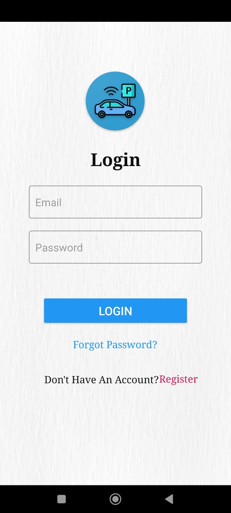
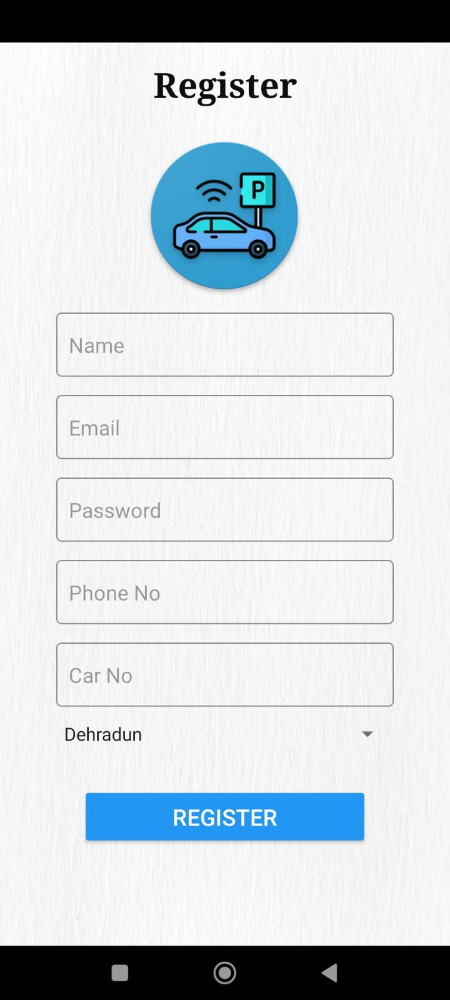
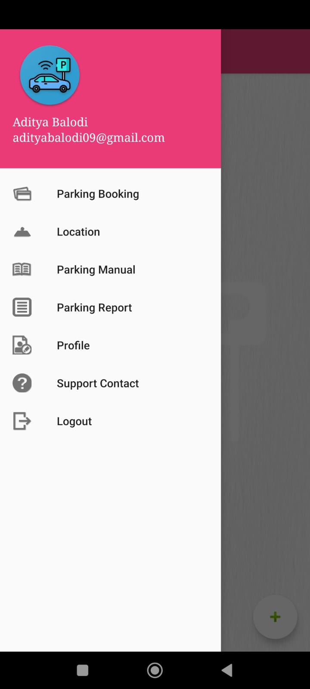

# Parking Tracker App

The Parking Tracker App is an Android application designed to simplify the process of booking parking slots in a parking facility and providing real-time vehicle tracking using Google Maps integration.

## Features

- **Parking Slot Booking**: Allows users to easily search for available parking slots, book slots in advance, and manage their bookings.
- **Real-Time Vehicle Tracking**: Integrates with Google Maps to provide users with real-time tracking of their parked vehicle within the parking facility.
- **Notifications**: Sends notifications to users for booking confirmation, reminders, and other important updates.
- **User Authentication**: Provides secure user authentication to ensure the privacy and security of user data.
- **Feedback and Rating**: Allows users to provide feedback and ratings for their parking experience, helping to improve the service.

## Screenshots

    
    
    

## Installation

1. Clone the repository:
git clone https://github.com/Adity-a/parking-tracker-app.git

2. Open the project in Android Studio.

3. Build and run the project on your Android device or emulator.

## Usage

1. **Registration/Login**: Users can register or login to their account using their email and password.

2. **Search for Parking**: Users can search for available parking slots based on location, date, and time.

3. **Book a Slot**: Once a suitable parking slot is found, users can book the slot and receive a confirmation.

4. **Vehicle Tracking**: After parking their vehicle, users can track its location in real-time using the app's integrated Google Maps feature.

5. **Manage Bookings**: Users can view and manage their parking bookings, including canceling bookings if needed.

## Technologies Used

- Android SDK
- Kotlin/Java
- Google Maps API
- Firebase Authentication
- Firebase Cloud Messaging

## Contributing

Contributions are welcome! If you have any ideas for improvements or new features, feel free to submit a pull request.

## License

This project is licensed under the MIT License. See the [LICENSE](LICENSE) file for more details.
